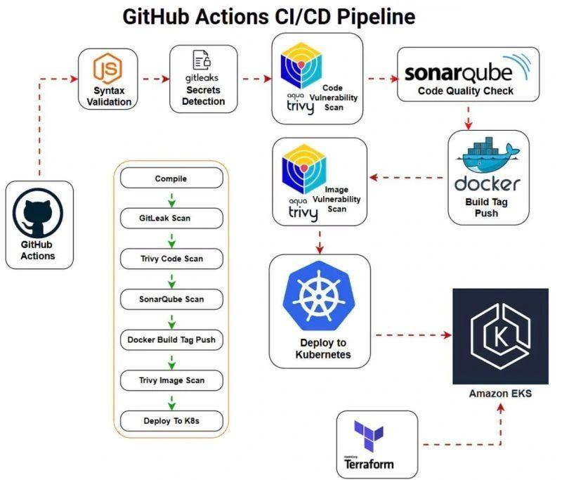

🚀 Pipeline CI/CD avec GitHub Actions – Java, Docker, Kubernetes (AWS EKS)

📌 Présentation

Ce projet met en place un pipeline CI/CD complet pour une application Java, en utilisant GitHub Actions.
Il couvre toutes les étapes essentielles du cycle de vie applicatif :

➡️ Build → Sécurité → Tests → Qualité → Docker → Déploiement Kubernetes (AWS EKS)

🏗️ Architecture

🔎 Description de l’architecture

L’architecture repose sur une chaîne d’intégration et de déploiement automatisée :

📦 Code source hébergé sur GitHub

⚙️ GitHub Actions orchestre le pipeline CI/CD

🖥️ Runner self-hosted exécute les jobs

🔐 Analyse sécurité avec Trivy & Gitleaks

📊 Analyse qualité via SonarQube

🐳 Docker pour la conteneurisation

☁️ AWS EKS pour l’orchestration Kubernetes

🔄 Flux global

Le développeur pousse du code sur GitHub
GitHub Actions déclenche le pipeline
Build + tests + scans sécurité
Analyse qualité (SonarQube)
Création de l’image Docker
Push vers Docker Hub
Déploiement automatique sur Kubernetes (EKS)

🔄 Fonctionnement du pipeline

1. Compilation
Build avec Maven

2. Sécurité (DevSecOps)
   
Scan avec Trivy
Scan secrets avec Gitleaks

3. Tests
   
Tests unitaires (mvn test)

4. Qualité & Build

Packaging .jar
Scan SonarQube + Quality Gate

5. Docker
    
Build & push image

6. Déploiement
 
Déploiement sur AWS EKS via kubectl

🛠️ Stack technique

CI/CD : GitHub Actions

Backend : Java 17, Maven

Sécurité : Trivy, Gitleaks

Qualité : SonarQube

Conteneurisation : Docker

Orchestration : Kubernetes

Cloud : AWS (EKS)

⚙️ Configuration

🔐 Secrets GitHub nécessaires :

SONAR_TOKEN

SONAR_HOST_URL

DOCKERHUB_TOKEN

DOCKERHUB_USERNAME

AWS_ACCESS_KEY_ID

AWS_SECRET_ACCESS_KEY

EKS_KUBECONFIG

▶️ Lancer le projet

git clone https://github.com/votre-username/votre-repo.git

cd votre-repo

git push origin master

📦 Image Docker
adildal/bankapp:latest

📊 Points forts

✔ Pipeline CI/CD complet

✔ Approche DevSecOps (sécurité intégrée)

✔ Déploiement cloud (AWS EKS)

✔ Automatisation totale

✔ Architecture scalable et moderne

📈 Améliorations possibles

Tests d’intégration

Déploiement Blue/Green

Monitoring (Prometheus / Grafana)

Helm pour Kubernetes
